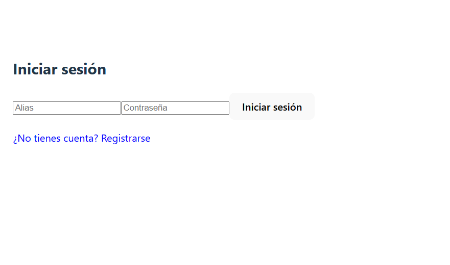
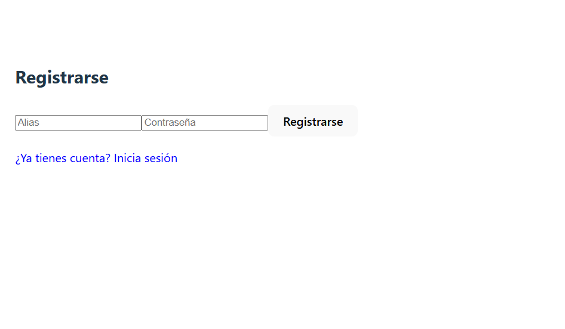

# 🚀 CRUD de Usuarios con React + Firebase + Vercel


> Proyecto CRUD completo usando React, Firebase Auth, Firestore, Hooks, Vite y despliegue en Vercel. Compatible con móvil y escritorio 📱💻

---

## 🧠 Tecnologías utilizadas

- ⚛️ React + Vite
- 🔥 Firebase (Auth + Firestore)
- ☁️ Deploy automático con Vercel
- 🧪 Git + GitHub (control de versiones)
- 🧠 Hooks (`useState`, `useEffect`)
- 🔐 Variables de entorno (`.env`)

---

## ✅ Funcionalidades

- Registro e inicio de sesión con alias + contraseña 🔐  
- CRUD completo de usuarios y profesiones 🧑‍💻  
- Almacenamiento por usuario autenticado (UID) en Firestore 🔒  
- Validaciones de campos obligatorios ⚠️  
- Interfaz responsive y moderna 🎯  
- Gestión visual: crear, editar y eliminar usuarios y profesiones  

---

## 📂 Estructura del proyecto

```
src/
├── componentes/
│   ├── FormularioUsuario.jsx
│   ├── ListaUsuarios.jsx
│   ├── CrudProfesiones.jsx
│   └── UsuariosCrud.jsx
├── firebaseConfig.js
├── App.jsx
└── main.jsx
```

---

## ⚙️ Variables de entorno

Crea un archivo `.env` con tus credenciales de Firebase:

```env
VITE_FIREBASE_API_KEY=TU_API_KEY
VITE_FIREBASE_AUTH_DOMAIN=TU_AUTH_DOMAIN
VITE_FIREBASE_PROJECT_ID=TU_PROJECT_ID
VITE_FIREBASE_STORAGE_BUCKET=TU_BUCKET
VITE_FIREBASE_MESSAGING_SENDER_ID=TU_SENDER_ID
VITE_FIREBASE_APP_ID=TU_APP_ID
```

---

## 🛠️ Instalación local

```bash
git clone https://github.com/NILSONCURSODAM/crud-usuarios-firebase.git
cd crud-usuarios-firebase
npm install
npm run dev
```

---

## 🌍 Demo en producción

🔗 https://crud-usuarios-firebase-xg75.vercel.app/

---

## 🧪 Imágenes del proyecto

### 🔐 Pantalla de Login


### 🧾 Pantalla de Registro


### 🧑‍💻 Interfaz del CRUD


---

## 👨‍💻 Autor

**Nilson Ochoa Martínez**  
📧 nilson-ochoamartinez@hotmail.com  
📍 Alicante, España  
🎓 Desarrollador Web & Móvil Junior

---

## 🧠 Descripción general

Aplicación web completa con autenticación y CRUD en tiempo real, desarrollada con React + Vite, Firebase (Auth + Firestore) y desplegada en Vercel. Cada usuario puede gestionar su información y profesiones de forma segura mediante su UID.

---

## 📁 Repositorio público

- GitHub: [https://github.com/NILSONCURSODAM/crud-usuarios-firebase](https://github.com/NILSONCURSODAM/crud-usuarios-firebase)
- Demo: [https://crud-usuarios-firebase-xg75.vercel.app](https://crud-usuarios-firebase-xg75.vercel.app)


